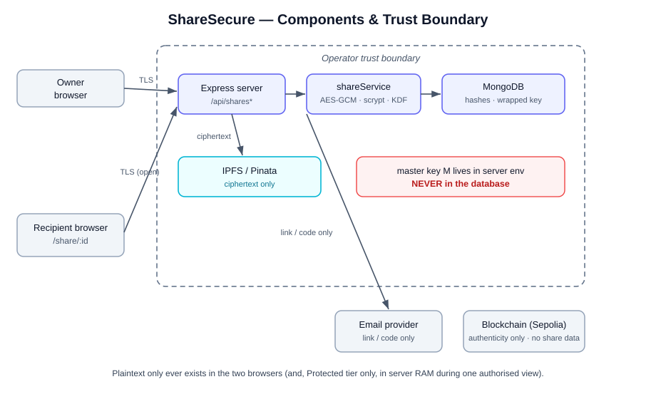
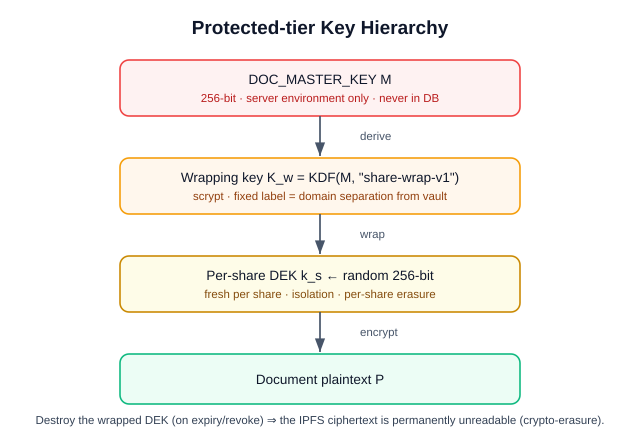
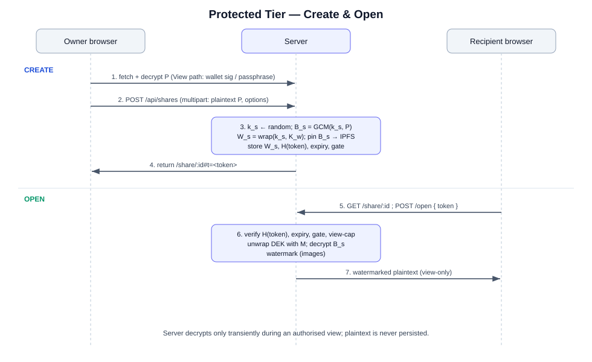
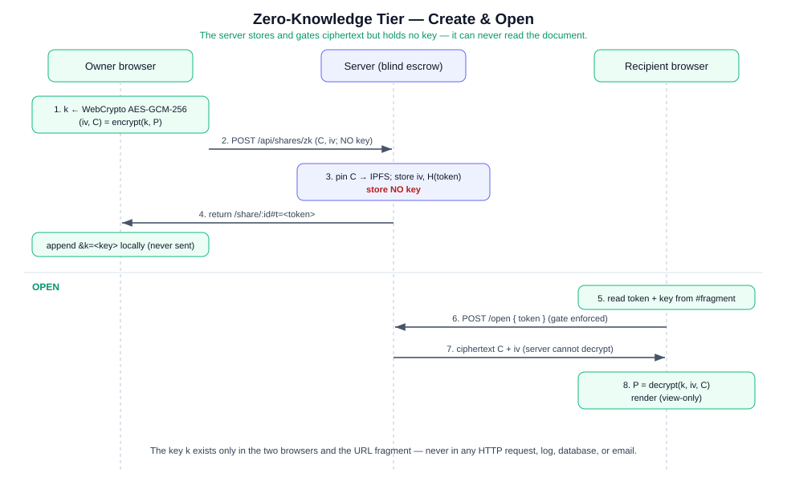
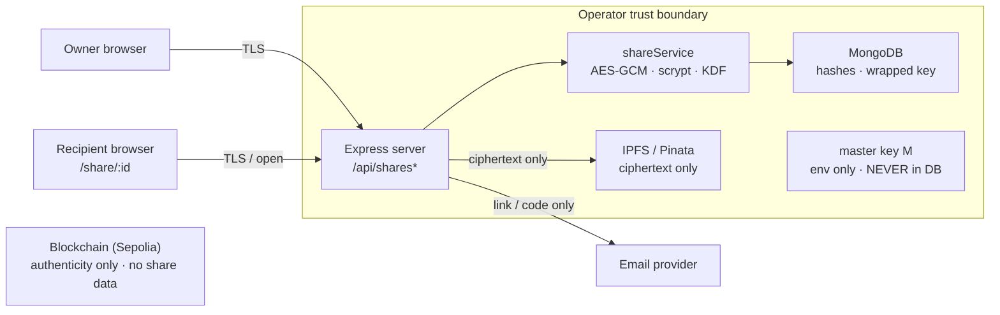
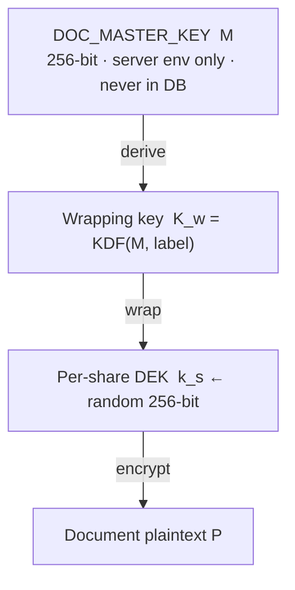

# ShareSecure: A Privacy-Maximising Architecture for Temporary, Encrypted Document Sharing on a Blockchain-Anchored Verification Platform

**Technical Research Report — DocVerify**
Version 1.0 · 2026-06-29

---

## Abstract

We present **ShareSecure**, the temporary document-sharing subsystem of *DocVerify*, a blockchain-anchored document verification platform. ShareSecure lets the holder of a document (an issuer or a recipient) grant another party **time-limited, revocable, privacy-preserving** access to a single document without exposing the document to any third party in readable form. The design is organised around a single principle we call **no data bridge**: a shared document is never available in plaintext to any system, network, or organisation outside the operator's trust boundary, and is never available *at all* — to anyone, including the operator — beyond an owner-selected expiry.

The system offers two interoperable confidentiality tiers. The **Protected (server-mediated)** tier re-encrypts each share under a fresh per-share data-encryption key (DEK) wrapped beneath a server-held master key, enabling per-viewer watermarking, view-only rendering, revocation and audit while keeping the document encrypted at rest on IPFS. The **Zero-Knowledge (client-mediated)** tier performs all encryption and decryption in the participants' browsers using the Web Crypto API and transports the decryption key only inside the URL *fragment*, which web browsers never transmit to a server; consequently the operator's servers never observe the key or the plaintext. Both tiers compose orthogonally with three recipient-authentication gates (open link, emailed one-time code, owner-set password), two audience models (anonymous capability link, bound registered user), user-selected expiry enforced by both runtime checks and database time-to-live (TTL) indexes, an optional maximum-view counter, instant revocation via **cryptographic erasure**, a tamper-evident access audit log, and per-IP rate limiting.

We give the threat model, the cryptographic construction with parameters and pseudocode, a per-actor privacy analysis for each tier, a security-property analysis, a comparative evaluation against common sharing mechanisms, and an honest account of limitations and future work. ShareSecure deliberately keeps share grants **off-chain**: the blockchain provides permanent, public proof of a document's *authenticity*, whereas a share is private, transient and revocable and therefore must not be written to an immutable public ledger.

**Keywords:** document sharing, end-to-end encryption, zero-knowledge delivery, capability URLs, cryptographic erasure, crypto-shredding, AES-GCM, scrypt, IPFS, authenticated encryption, key wrapping, watermarking, privacy by design.

---

## Table of Contents

1. [Introduction](#1-introduction)
2. [Background](#2-background)
3. [Threat Model](#3-threat-model)
4. [Design Goals and Privacy Principles](#4-design-goals-and-privacy-principles)
5. [System Architecture](#5-system-architecture)
6. [Cryptographic Design](#6-cryptographic-design)
7. [Temporal Access Control and Cryptographic Erasure](#7-temporal-access-control-and-cryptographic-erasure)
8. [Authentication Gates and Audience Models](#8-authentication-gates-and-audience-models)
9. [Privacy Analysis](#9-privacy-analysis)
10. [Security Analysis](#10-security-analysis)
11. [Accountability: Watermarking and Audit](#11-accountability-watermarking-and-audit)
12. [Comparative Evaluation](#12-comparative-evaluation)
13. [Implementation](#13-implementation)
14. [Limitations](#14-limitations)
15. [Future Work](#15-future-work)
16. [Conclusion](#16-conclusion)
17. [References](#17-references)
- [Appendix A: Notation](#appendix-a-notation)
- [Appendix B: API Specification](#appendix-b-api-specification)
- [Appendix C: Data Model](#appendix-c-data-model)
- [Appendix D: Cryptographic Parameters](#appendix-d-cryptographic-parameters)
- [Appendix E: Reproducibility Map](#appendix-e-reproducibility-map)
- [Appendix F: Figures](#appendix-f-figures)

---

## 1. Introduction

### 1.1 Motivation

Organisations that issue verifiable documents — universities, hospitals, government agencies, employers — routinely need their clients to *forward* a document to a third party for a short, bounded purpose: a graduate shares a degree certificate with a prospective employer for a 48-hour background check; a patient shares a medical record with a specialist for one consultation. The dominant tools for this are catastrophic for privacy:

- **Email attachments** place a permanent, unencrypted copy on at least two mail servers and every device in the delivery path.
- **Cloud "anyone with the link" shares** (Google Drive, Dropbox) place plaintext on a third-party server indefinitely, expose rich access metadata to that provider, and are notoriously hard to truly revoke or expire.
- **Public content-addressed links** (e.g. a raw IPFS gateway URL) are effectively permanent and world-readable once the CID leaks.

None of these satisfy the requirement we set for a *security product*: a shared document must be **encrypted**, **private** (not merely "obscure"), **temporary** (it must stop working, provably, at a chosen time), **revocable**, **auditable**, and must **never traverse a third party in readable form**. We refer to this last requirement informally as *"no data bridge."*

### 1.2 Contributions

This report documents the following contributions of the ShareSecure subsystem:

1. **A dual-tier confidentiality model** that lets the *owner* trade off operator capabilities (watermarking, view-only enforcement, audit) against absolute confidentiality (zero-knowledge), per share, without changing the rest of the pipeline (§6).
2. **A zero-knowledge web-delivery construction** in which the decryption key lives exclusively in the URL fragment and is never transmitted to the server, combined with a server-enforced access gate that withholds the *ciphertext* until authorisation succeeds — giving both end-to-end confidentiality *and* server-side revocation/expiry (§6.3).
3. **Expiry as cryptographic erasure.** Expiry and revocation do not merely flag a record; they destroy the only key capable of decrypting the share, rendering the ciphertext that remains on IPFS permanently unreadable (§7).
4. **A defence-in-depth capability scheme** combining a 256-bit unguessable capability token (stored only as a hash) with optional out-of-band recipient authentication (emailed one-time code or password), so that a leaked link alone is insufficient (§8).
5. **An off-chain/​on-chain separation argument**: why a privacy-preserving, revocable, temporary grant must *not* be placed on the immutable, public ledger that anchors document authenticity (§5.2).
6. **A per-actor privacy analysis** that precisely characterises what every party in the system — server operator, storage provider, mail provider, network observer, database attacker, link interceptor — can and cannot learn, in each tier (§9).

---

## 2. Background

### 2.1 The DocVerify platform

DocVerify is a two-portal application. An **Issuer Portal** lets an organisation publish an original document: the document is fingerprinted, optionally encrypted, pinned to IPFS (via Pinata), and a cryptographic commitment (a keccak-256 file hash, the issuer and recipient wallet addresses, and the IPFS CID) is recorded on the Ethereum Sepolia blockchain through a registry smart contract. A **User Portal** lets recipients receive issued documents and run a five-layer authenticity check (SHA-256 exact hash, perceptual hash, invisible watermark, AI forgery forensics, and the on-chain record).

Two encryption mechanisms predate ShareSecure and are relevant to it:

- A **server-gated vault** (magic header `DVSITE01`): documents are encrypted with AES-256-GCM under a key derived from the user's passphrase *and* a server-held master key (`DOC_MASTER_KEY`), so a document can only be decrypted on the operator's site and only when the passphrase is supplied. The ciphertext on IPFS is opaque to anyone holding only the CID and passphrase.
- A legacy **client-side format** (magic header `DOCVENC1`) in which the browser encrypted files before upload. This format is deprecated; documents in it must be re-published to be shareable.

ShareSecure builds on, and reuses, the vault's primitives but introduces its own key hierarchy and delivery model.

### 2.2 Content-addressed storage (IPFS)

IPFS addresses content by the hash of its bytes (the CID). This is excellent for integrity and deduplication but has two privacy consequences ShareSecure must respect: (i) anyone who learns a CID can fetch the bytes from any gateway, so **only ciphertext may ever be pinned**; and (ii) "deletion" is not guaranteed — unpinning removes the operator's pin but cannot recall copies. ShareSecure therefore treats IPFS as an *untrusted, append-only ciphertext store* and relies on **key destruction**, not byte deletion, for its erasure guarantee (§7).

### 2.3 Blockchain anchoring vs. sharing

The blockchain in DocVerify provides a *permanent, public* proof that a particular document existed and was issued by a particular party. Sharing has the opposite requirements — *private, temporary, revocable* — and is therefore deliberately **not** placed on-chain (§5.2).

---

## 3. Threat Model

### 3.1 Assets

| Asset | Sensitivity |
|---|---|
| Document plaintext (e.g. identity, medical, academic records) | High — confidentiality is the primary objective |
| Decryption keys (per-share DEKs, master key, capability tokens) | Critical |
| Access metadata (who opened what, when, from where) | Medium — privacy + accountability |
| Existence/relationship metadata (who shared with whom) | Medium |

### 3.2 Adversaries

We consider the following adversaries, consistent with a "highest-level" security posture for a B2B verification service:

- **A1 — Network eavesdropper.** Observes traffic between browser and server.
- **A2 — Curious storage provider (IPFS/Pinata).** Can read everything it stores.
- **A3 — Curious mail provider.** Can read everything that passes through email.
- **A4 — Link interceptor.** Obtains a share URL not intended for them (forwarded mail, shoulder-surf, proxy log).
- **A5 — Database attacker.** Obtains a full dump of the application database (`document_shares`, `share_access_logs`, etc.).
- **A6 — Honest-but-curious operator.** Runs the server faithfully but may inspect data at rest and in memory.
- **A7 — Malicious recipient.** A legitimately authorised viewer who attempts to exfiltrate, re-share, or retain access after expiry.
- **A8 — Brute-force/enumeration attacker.** Attempts to guess capability tokens, share identifiers, one-time codes, or passwords.
- **A9 — Fully compromised server.** Attacker controls server code execution (considered only to scope the zero-knowledge tier's guarantees honestly; see §14).

### 3.3 Trust assumptions

- The cryptographic primitives (AES-256-GCM, SHA-256, scrypt) and the platform CSPRNG are secure.
- TLS protects the browser–server channel against A1 (transport confidentiality and integrity).
- The server-held master key `DOC_MASTER_KEY` is stored in the server environment, **never in the database**, and is not exfiltrated except under A9.
- For the **Protected tier**, the operator (A6) is *trusted to handle plaintext transiently during an authorised view* and not to persist it. This is an explicit, documented trade-off, identical to the trust already placed in the operator by the pre-existing server-gated vault.
- For the **Zero-Knowledge tier**, the operator is **not** trusted with plaintext or keys under A1–A6; the residual trust under A9 (server can serve malicious client code) is discussed honestly in §14.

### 3.4 Out of scope

Endpoint compromise of an authorised viewer's device (keyloggers, screen capture malware), coercion of an authorised viewer, and physical photography of a rendered screen are out of scope for *prevention* but partially addressed for *accountability* by per-viewer watermarking (§11).

---

## 4. Design Goals and Privacy Principles

ShareSecure is engineered to the following goals; later sections show how each is met.

- **G1 — Confidentiality at rest and in transit.** No plaintext is ever written to durable storage outside the operator boundary; TLS protects transport. (§6, §9)
- **G2 — No data bridge.** No third party (storage, mail, network, gateway) ever holds the document in readable form, nor any key sufficient to read it. (§9)
- **G3 — Temporality with proof.** Access ends at an owner-chosen time, enforced redundantly and made *irreversible* by key destruction. (§7)
- **G4 — Privacy beyond obscurity.** "Anyone with the link" is offered, but the owner can require an independent authentication factor so a leaked link is insufficient. (§8)
- **G5 — Owner control.** Instant revocation, view caps, and per-share policy. (§7, §8)
- **G6 — Accountability.** Per-share, append-only audit; per-viewer watermarking. (§11)
- **G7 — Maximal confidentiality option.** A tier in which even the operator cannot read the document. (§6.3)
- **G8 — Least privilege & need-to-know.** Every component receives the minimum it needs: storage gets ciphertext, mail gets a link, the database gets hashes. (§9)
- **G9 — Defence in depth.** Independent barriers (capability secrecy, gate authentication, encryption, rate limiting, expiry) so that the failure of one does not collapse the system. (§10)

These instantiate the classic *privacy-by-design* and *data-minimisation* doctrines: collect/expose the least, protect by default, and make the secure path the default path.

---

## 5. System Architecture

### 5.1 Components and trust boundaries

```
                         TRUST BOUNDARY (operator)
        ┌───────────────────────────────────────────────────────────┐
 Owner  │   Express server (Node.js)                                 │
Browser │   ┌─────────────┐   ┌──────────────┐   ┌───────────────┐   │
  ──────┼──▶│ Share routes │──▶│ shareService │   │  MongoDB      │   │
 (TLS)  │   │ /api/shares* │   │ (AES-GCM,    │──▶│ document_     │   │
        │   └─────┬───────┘    │  scrypt,KDF) │   │ shares,       │   │
        │         │            └──────────────┘   │ access_logs   │   │
        │         │  ciphertext only                └───────────────┘  │
        │         ▼                                                    │
        │   ┌──────────────┐                  master key M lives in    │
        │   │ Pinata / IPFS│◀── pin ciphertext   process env, NOT DB   │
        │   └──────────────┘                                           │
        └───────────────────────────────────────────────────────────┘
              ▲                         │
   ciphertext │                         │ link (+ one-time code)
   fetch (TLS)│                         ▼
        ┌───────────────┐         ┌───────────┐
        │  Recipient    │         │   Email   │   (carries link/code only,
        │  Browser      │         │  provider │    NEVER document or key)
        │ /share/:id    │         └───────────┘
        └───────────────┘
              │
              ▼
        Blockchain (Sepolia): authenticity proof ONLY — no share data
```

The defining property of this layout: **the only systems that ever touch the document are the operator's server (transiently, Protected tier only) and the two participants' browsers.** IPFS holds ciphertext; email holds a link; the blockchain holds nothing about the share; the database holds hashes and a wrapped key (or, in the zero-knowledge tier, no key at all).

### 5.2 Why shares are off-chain

It is tempting, on a "blockchain platform," to record shares on-chain. We argue this is a privacy anti-pattern and deliberately avoid it:

| Property required of a share | On-chain reality | Conclusion |
|---|---|---|
| **Private** | Ledger entries are world-readable | On-chain leaks who-shared-what-with-whom |
| **Temporary** | Ledger entries are permanent | Cannot truly expire |
| **Revocable** | Ledger entries are immutable | Cannot truly revoke |
| **Cheap/instant** | Writes cost gas + block latency | Poor UX for a per-document action |

The blockchain's strength — immutable, public permanence — is exactly what *authenticity proof* needs and exactly what *private sharing* must avoid. ShareSecure therefore stores shares in the application database, **referencing** the already-anchored document by its identifier. The ledger answers "is this document authentic?"; ShareSecure answers "may this person see it, right now?" — and the latter answer must be erasable.

### 5.3 End-to-end data flow (Protected tier)

```
CREATE                                            OPEN
owner browser                  server             recipient browser     server
─────────────                  ──────             ─────────────────     ──────
1 obtain plaintext P  ──auth──▶ (same path as     1 GET /share/:id  ───▶ serve minimal page
  via the View flow             "View": MetaMask   2 read token t from URL #fragment
  (decrypt locally if           sig / passphrase)  3 POST /open {t} ────▶ verify H(t), expiry,
  vault-encrypted)                                                        revoked, view cap, gate
2 POST /api/shares  ─────────▶  k_s ← random DEK   4                 ◀─── unwrap DEK with M,
  (multipart: P, opts)          B_s=GCM_{k_s}(P)        watermarked        decrypt B_s, watermark
                                W_s=GCM_{Kw}(k_s)       plaintext          (images), return base64
                                pin B_s → IPFS
                                store W_s, H(t)…
3 receive /share/:id#t ◀──────  return URL
```

### 5.4 End-to-end data flow (Zero-Knowledge tier)

```
CREATE                                            OPEN
owner browser                  server             recipient browser          server
─────────────                  ──────             ─────────────────          ──────
1 obtain plaintext P locally                      1 read t and k from #fragment
2 k ← random 256-bit (WebCrypto)                   2 POST /open {t} ────────▶ verify gate/expiry…
3 C = GCM_k(P)  (in browser)                       3                 ◀─────── return ciphertext C + iv
4 POST /api/shares/zk ───────▶ pin C → IPFS           (server CANNOT decrypt; holds no key)
  (multipart: C, iv; NO key)    store iv, H(t)…    4 P = GCM_k^{-1}(C, iv)   (decrypt in browser)
5 URL = /share/:id#t=…&k=…      return /share/:id#t  5 render P, view-only
  (browser appends k locally)   (WITHOUT k)
```

The server in the zero-knowledge tier is a *blind escrow with a gate*: it stores and serves ciphertext, and it enforces *when* the ciphertext may be served (expiry, revocation, view cap, recipient authentication), but it has no means to read the ciphertext. The key `k` is generated in the owner's browser and appended to the link's fragment **client-side**; it is never sent to the server in step 4 or step 5.

---

## 6. Cryptographic Design

### 6.1 Notation and primitives

See [Appendix A](#appendix-a-notation) for the full notation table and [Appendix D](#appendix-d-cryptographic-parameters) for parameters. We use:

- `Enc^{GCM}_K(P) → (iv, tag, C)` and its inverse — AES-256-GCM authenticated encryption with a random 96-bit `iv` and 128-bit `tag` (NIST SP 800-38D, FIPS 197).
- `KDF(secret, salt) → 32 bytes` — scrypt with cost parameters `N = 2^14, r = 8, p = 1` (RFC 7914), a memory-hard function chosen to make offline guessing of human secrets expensive.
- `H(x)` — SHA-256 (FIPS 180-4).
- `R(n)` — `n` cryptographically secure random bytes from the platform CSPRNG.
- `M` — the 256-bit server master key (`DOC_MASTER_KEY`), held only in the server environment.

All ciphertext objects are self-describing, beginning with an 8-byte ASCII magic header that identifies the format (`DVSHARE1` for a ShareSecure server blob, `DVSITE01` for the pre-existing vault).

### 6.2 Protected (server-mediated) tier

This tier maximises *operator capability* (watermarking, view-only rendering, revocation, audit) while keeping the document encrypted at rest and never persisting plaintext.

#### 6.2.1 Key hierarchy

```
DOC_MASTER_KEY (M, 256-bit, env only)
        │  KDF(M, "docverify-share-wrap-v1")   ← fixed-salt domain separation
        ▼
Wrapping key  K_w  (256-bit, derived on demand, never stored)
        │  wraps (encrypts)
        ▼
Per-share DEK  k_s  (256-bit, fresh random per share)
        │  encrypts
        ▼
Document plaintext  P
```

A **fresh DEK per share** means that compromising one share's key reveals nothing about any other share or about the original document, and that destroying one DEK erases exactly one share. The wrapping key is derived from the master key with a *fixed, purpose-specific salt label* (`"docverify-share-wrap-v1"`) so that it is cryptographically separated from the vault's passphrase-derived keys even though both draw on the same master key (domain separation).

#### 6.2.2 Creation

```
function CreateProtectedShare(P, options):
    require isMasterConfigured()
    k_s   ← R(32)                              # fresh per-share DEK
    (iv, tag, C) ← Enc^{GCM}_{k_s}(P)
    B_s   ← "DVSHARE1" ‖ iv ‖ tag ‖ C          # self-describing share blob
    K_w   ← KDF(M, "docverify-share-wrap-v1")
    (iv', tag', C') ← Enc^{GCM}_{K_w}(k_s)
    W_s   ← base64(iv' ‖ tag' ‖ C')            # wrapped DEK (stored in DB)
    cid   ← IPFS.pin(B_s)                       # only ciphertext leaves the server
    t     ← R(32)                               # capability token (link audience)
    store DocumentShare{ id, cid, W_s, H(t), mime, expiry, gate, … }
    return  origin ‖ "/share/" ‖ id ‖ "#t=" ‖ base64url(t)
```

Note that the document plaintext `P` is supplied by the **owner's browser**, which obtains it through exactly the same authenticated path used to *view* the document (a MetaMask signature for received documents; a passphrase prompt for vault-encrypted documents). This unifies "can view" with "can share," guarantees the correct file type is preserved, and means the server re-encrypts the *real* document, not an opaque legacy blob.

#### 6.2.3 Opening

```
function OpenProtectedShare(id, t, gateInput):
    s ← lookup(id);  assert s.exists ∧ ¬s.revoked ∧ now < s.expiry ∧ s.views < s.maxViews
    assert ConstTimeEq(H(t), s.tokenHash)        # capability check
    assert GatePasses(s, gateInput)              # §8 (none / OTP / password)
    K_w ← KDF(M, "docverify-share-wrap-v1")
    k_s ← Dec^{GCM}_{K_w}(s.W_s)                  # unwrap DEK
    P   ← Dec^{GCM}_{k_s}(s.B_s from IPFS)        # authenticated decryption
    if isImage(P): P ← Watermark(P, recipient, docId, timestamp)   # §11
    s.views += 1;  log(s, "opened")
    return P   (base64, view-only)
```

The plaintext exists only transiently in server memory for the duration of an authorised response and is never written to disk. This is the explicit trust trade-off of the Protected tier (A6).

### 6.3 Zero-Knowledge (client-mediated) tier

This tier maximises *confidentiality*: the operator never holds the key or the plaintext, in memory or at rest. It is the design's answer to "even your own server must not be able to read it."

#### 6.3.1 The fragment-key construction

The decryption key travels in the **fragment** component of the URL (the part after `#`). Per the URI standard and uniform browser behaviour, the fragment is **never included in HTTP requests** — it is not in the request line, not in the `Referer` header (further hardened here by `Referrer-Policy: no-referrer`), and not in server access logs. The browser retains the fragment locally and exposes it to client-side JavaScript via `location.hash`.

```
Share URL:   https://host/share/<id>#t=<token>&k=<key>
                                       └───┬──┘ └──┬─┘
                          capability token (server) decryption key (client only)
```

Thus a single URL carries two secrets to two different destinations: the **token** is posted to the server to pass the access gate; the **key** never leaves the browser.

#### 6.3.2 Creation and opening

```
CreateZK (owner browser):                       OpenZK (recipient browser):
  k  ← WebCrypto.generateKey(AES-GCM, 256)         read t, k from location.hash
  (iv, C) ← WebCrypto.encrypt(k, P)                (gate handled server-side)
  upload C, iv to /api/shares/zk  (NO k)           C, iv ← POST /open {t}      # server blind
  url ← serverURL + "#t=…" + "&k=" + b64url(k)     P ← WebCrypto.decrypt(k, iv, C)
                                                    render P
Server (zk create):  pin C → IPFS;  store iv, H(t), expiry, gate;  store NO key.
Server (zk open):    after gate passes, return C + iv;  cannot decrypt (holds no k).
```

The crucial composition: the **server still enforces the access gate and expiry** before releasing the ciphertext, so the zero-knowledge tier *also* benefits from revocation, expiry, view caps and recipient authentication — properties that pure "key-in-link" schemes (e.g. a naive client-side-encrypted blob on a CDN) cannot offer because they have no gatekeeper. ShareSecure separates *who may obtain the ciphertext* (server-enforced) from *who can read it* (key-in-fragment), and requires **both**.

Because the zero-knowledge key must be delivered inside the link, this tier is restricted to the **link audience** (it cannot be delivered to a registered user's in-portal inbox, which carries no fragment). Registered-user shares therefore use the Protected tier.

### 6.4 Capability tokens

A share is located by a **non-secret identifier** (a UUID, used in the path and for owner-side management) and authorised by a **secret capability token** `t = R(32)` — 256 bits of entropy, rendered URL-safe (base64url) and placed in the fragment. The server stores **only** `H(t) = SHA-256(t)`. Verification recomputes `H(t)` and compares using a **constant-time** equality test, eliminating timing side channels. Consequences:

- **Unguessability.** 2^256 token space defeats enumeration (A8); the public UUID identifier carries no authority by itself.
- **Database-leak resistance.** A dump (A5) yields token *hashes*, not tokens; live links cannot be reconstructed from the database.
- **Log hygiene.** The token is in the fragment and is posted in a request body, never appearing in URLs, server logs, or `Referer` headers.

### 6.5 Authenticated encryption everywhere

Every encryption in the system is **authenticated** (AES-GCM). This provides confidentiality *and* integrity: any tampering with a share blob, a wrapped key, or a zero-knowledge ciphertext causes decryption to fail closed rather than yield manipulated plaintext. Because each share uses a *fresh* key and a *fresh random 96-bit IV*, the catastrophic GCM failure mode (IV reuse under the same key) does not arise in normal operation.

---

## 7. Temporal Access Control and Cryptographic Erasure

### 7.1 User-selected expiry

At creation the owner selects an expiry: presets of 1 hour, 24 hours, or 7 days, or a custom timestamp, bounded by a hard maximum of **90 days**. The chosen instant is stored as `expiresAt`.

### 7.2 Redundant enforcement

Expiry is enforced by **two independent mechanisms** (defence in depth):

1. **Runtime check.** Every `meta`/`open` request rejects a share whose `expiresAt` is in the past (HTTP 410 Gone). The frontend never enforces expiry alone; the server is authoritative.
2. **Database TTL index.** A MongoDB TTL index on `expiresAt` (`expireAfterSeconds: 0`) causes the database to *delete the share record* at the expiry instant, independently of any application code path.

### 7.3 Expiry and revocation as cryptographic erasure

The most important temporal property is that ShareSecure does not rely on *byte deletion* (impossible to guarantee on IPFS) but on **key destruction**:

- In the **Protected tier**, the only key that can decrypt a share's ciphertext is the per-share DEK `k_s`, which exists *only* in wrapped form `W_s` inside the database record. When the TTL index deletes the record, `W_s` is destroyed with it; thereafter the ciphertext `B_s` remaining on IPFS is **permanently undecryptable by anyone, including the operator** — even an attacker holding both the IPFS bytes and the master key cannot recover `k_s`. This is *cryptographic erasure* (a.k.a. crypto-shredding), the technique NIST SP 800-88 recognises for sanitising data whose physical deletion cannot be assured.
- **Revocation** performs the same erasure on demand and immediately: the handler sets `revoked = true`, **unsets the wrapped key** `W_s`, and issues a best-effort IPFS unpin. The unpin is a courtesy (it may free storage); the *guarantee* is the key destruction.
- In the **Zero-Knowledge tier**, the server never held a key to destroy; revocation/expiry causes the server to **refuse to serve the ciphertext**, and the recipient never possessed the ciphertext without first passing the gate. (The key in a previously-shared fragment cannot decrypt ciphertext the recipient can no longer obtain.)

This converts "expired" and "revoked" from policy flags into *mathematical facts*: after the event, no decryption is possible.

---

## 8. Authentication Gates and Audience Models

ShareSecure separates **who is allowed to obtain access** (audience), **how they prove they are that party** (gate), and **how the document is protected** (tier). All three are independent and composable.

### 8.1 Audiences

- **Link (anonymous capability).** Access is conferred by possession of the capability token. Suitable for external parties without an account.
- **Registered user (bound identity).** The share is bound to a specific recipient by email and/or wallet address. It appears in that user's "Shared with me" area and is opened with their authenticated session; the server checks that the logged-in identity matches the bound recipient. No capability token is issued, removing the "forwardable link" risk entirely. (Registered-user shares use the Protected tier; see §6.3.)

### 8.2 Gates

Independent of audience, the owner may require an additional authentication factor before the document is released:

- **None.** Capability (or bound identity) alone suffices.
- **Emailed one-time code (OTP).** On open, the recipient requests a 6-digit code, which the server emails to the *bound recipient address*. The code is stored only as a hash, expires in 10 minutes, and is rate-limited with a **5-attempt cap** after which a fresh code is required. This upgrades a link share to *two factors*: possession of the link **and** control of a specific mailbox — so an intercepted link (A4) is useless without the inbox.
- **Password.** The owner sets a passphrase, communicated to the recipient out-of-band (call, SMS). It is stored as `scrypt(password, salt)` and verified in constant time.

### 8.3 Optional view cap

An optional maximum-view counter (`maxViews`) closes a share after a chosen number of successful opens — useful for one-time disclosures and for bounding exposure if a link is later mishandled.

### 8.4 Composability

The Cartesian product of {2 audiences} × {3 gates} × {2 tiers} × {expiry, view-cap} gives the owner fine-grained, per-document control. Representative policies:

| Scenario | Audience | Gate | Tier | Expiry |
|---|---|---|---|---|
| Send a certificate to an employer for a background check | Link | Email code | Protected (watermark + audit) | 48 h |
| Maximum-secrecy disclosure to a journalist | Link | Password | Zero-knowledge | 6 h, 1 view |
| Internal hand-off to a colleague with an account | Registered user | None (session) | Protected | 7 d |

---

## 9. Privacy Analysis

This section is the core of the "maximum privacy" claim. For each adversary/party we state precisely what is learnable, per tier. **"—" means the party learns nothing of that asset.**

### 9.1 Per-actor knowledge — Protected tier

| Party | Document plaintext | Decryption key | Access metadata |
|---|---|---|---|
| IPFS / Pinata (A2) | — (ciphertext only) | — | — |
| Mail provider (A3) | — | — | the link, and (if OTP) the code |
| Network eavesdropper (A1) | — (TLS) | — (TLS) | — |
| Database attacker (A5) | — | — (only *wrapped* DEK; useless without `M`, which is not in the DB) | share existence, recipient email, hashes, timestamps |
| Honest-but-curious operator (A6) | **transiently, during an authorised view only** (never persisted) | yes (holds `M`) | yes |
| Link interceptor (A4) | only if no gate is set; blocked by OTP/password | — | — |

### 9.2 Per-actor knowledge — Zero-Knowledge tier

| Party | Document plaintext | Decryption key | Access metadata |
|---|---|---|---|
| IPFS / Pinata (A2) | — (ciphertext only) | — | — |
| Mail provider (A3) | — | — *(key is in the fragment, not emailed)* † | the link, and (if OTP) the code |
| Network eavesdropper (A1) | — (TLS; key never on the wire) | — | — |
| Database attacker (A5) | — | — *(no key is stored at all)* | share existence, recipient email, hashes, timestamps |
| Operator (A6) | **never** | **never** | yes |
| Link interceptor (A4) | only if no gate is set; blocked by OTP/password | from the fragment if they hold the full link | — |

† *Caveat:* if the **owner** chooses to deliver the full zero-knowledge link (including `#k=…`) through email, that mail provider would then see the key. The product guidance is to deliver zero-knowledge links out-of-band; the architecture does not itself place the key in email.

### 9.3 The "no data bridge" property

Combining the two tables, in **neither** tier does any third party (storage, mail, network, gateway) ever hold the document in readable form, and in the **zero-knowledge** tier not even the operator does. The document's plaintext exists only in (a) the owner's browser at creation, (b) the recipient's browser at viewing, and (c) — Protected tier only — the operator's RAM during a single authorised response. There is no point at which a readable copy "bridges" through an intermediary. This is precisely the requirement that motivated the project.

### 9.4 Metadata minimisation and residual exposure

ShareSecure practises data minimisation: the database stores **hashes** of the capability token, password, and one-time code rather than the secrets themselves, and stores the DEK only in **wrapped** form (Protected) or **not at all** (zero-knowledge). The principal residual metadata is: the existence of a share, its document type/number, the bound recipient's email address (required to *send* an OTP and to match a registered user), expiry, and access timestamps with source IPs in the audit log. A future hardening (see §15) is to store recipient addresses as salted hashes where exact-match suffices, at the cost of losing the ability to email a code.

---

## 10. Security Analysis

We argue informally that the construction provides the following properties.

### 10.1 Confidentiality

Document confidentiality reduces to the security of AES-256-GCM under a key unavailable to the adversary. In the Protected tier the DEK is protected by `M` (A1–A5 do not hold `M`; it is never in the database or on the wire). In the zero-knowledge tier the key never leaves the browser, so A1–A6 never possess it. In both tiers, IPFS and mail (A2, A3) see only ciphertext or links. Confidentiality therefore holds against A1–A5 in both tiers and additionally against A6 in the zero-knowledge tier.

### 10.2 Integrity and authenticity

Every ciphertext object is GCM-authenticated; tampering (by A2 on stored bytes, or A1 absent TLS) is detected and decryption fails closed. The document's *authenticity* (that it is the genuine issued original) is independently guaranteed by the platform's on-chain hash commitment, which a verifier can check separately.

### 10.3 Capability unforgeability

A capability token has 256 bits of entropy; guessing one (A8) is infeasible. Only the hash is stored, so a database breach (A5) does not yield usable tokens, and constant-time comparison removes timing leaks. Share identifiers (UUIDs) confer no authority by themselves.

### 10.4 Resistance to brute force and enumeration

- **Tokens/IDs:** entropy + hashing + constant-time compare (above).
- **One-time codes:** short-lived (10 min), hashed, **5-attempt cap**, and rate-limited per IP, bounding online guessing of the ~10^6 code space to a negligible success probability.
- **Passwords:** memory-hard `scrypt` raises the cost of offline guessing against a database leak.
- **All public share endpoints** (`meta`, `open`, `send-code`) are governed by a dedicated rate limiter (60 requests / 15 minutes / IP), throttling automated probing (A8).

### 10.5 Temporal soundness and erasability

Expiry/revocation are enforced server-side (never trusting the client clock) *and* realised as key destruction (§7), giving an *irreversible* end-of-life: post-expiry, decryption is mathematically impossible, not merely disallowed.

### 10.6 Least privilege, domain separation, defence in depth

Each component receives the minimum: storage→ciphertext, mail→link, database→hashes. The share wrapping key is domain-separated from the vault's key derivation via a distinct salt label, so the two subsystems cannot interfere. Multiple independent barriers (capability secrecy, gate authentication, encryption, rate limiting, expiry, view caps) mean no single failure is catastrophic — e.g. a leaked link is still stopped by an OTP gate; a stolen database still cannot open a zero-knowledge share.

### 10.7 Authorisation to create and open

Creating a share requires proof of ownership of the document — a wallet signature (issuer) or an authenticated session whose email/wallet matches the record (recipient). For received documents this surfaces as an explicit MetaMask **signature request**, giving the owner a deliberate confirmation step. Opening a registered-user share requires an authenticated session matching the bound recipient; opening a link share requires the capability token plus any configured gate.

---

## 11. Accountability: Watermarking and Audit

Because *prevention* of screen photography is impossible (out of scope, §3.4), ShareSecure invests in *accountability*.

### 11.1 Per-viewer dynamic watermarking

In the Protected tier, image documents are watermarked **at view time** with a tiled, low-opacity overlay carrying the recipient identifier, the document identifier, and a timestamp. Because the watermark is applied server-side after decryption and is specific to the viewing event, any screenshot or photograph of a shared image is traceable to the recipient and moment of access. (The zero-knowledge tier cannot watermark, since the server never sees plaintext — this is the deliberate cost of maximal confidentiality. Visible watermarking of PDFs is not yet implemented; see §14–15.)

### 11.2 Append-only access audit

Every consequential action — creation, successful open, denial, code dispatch, gate failure, revocation — is written to an append-only `share_access_logs` collection with the share and document identifiers, the event type and detail, the source IP, the user agent, and a timestamp. Owners can review the per-share activity trail. This supports breach detection, compliance evidence, and forensic reconstruction of who accessed a document and when.

---

## 12. Comparative Evaluation

| Property | Email attachment | Cloud "anyone with link" | Public IPFS URL | Password-protected PDF | **ShareSecure — Protected** | **ShareSecure — Zero-Knowledge** |
|---|:---:|:---:|:---:|:---:|:---:|:---:|
| Encrypted at rest off-operator | ✗ | partial (provider-held key) | ✗ | ✓ (weak KDF) | ✓ | ✓ |
| Third party can read plaintext | ✓ (mail servers) | ✓ (cloud provider) | ✓ (anyone) | ✗ | ✗ | ✗ |
| Operator can read plaintext | n/a | ✓ | n/a | n/a | transiently (by design) | **✗ (never)** |
| Enforced expiry | ✗ | partial | ✗ | ✗ | ✓ (+ crypto-erase) | ✓ (+ withhold) |
| True revocation | ✗ | partial | ✗ | ✗ | ✓ (crypto-erase) | ✓ |
| Second factor beyond the link | ✗ | varies | ✗ | password only | ✓ (OTP/password) | ✓ (OTP/password) |
| Per-viewer watermark | ✗ | ✗ | ✗ | ✗ | ✓ (images) | ✗ |
| Access audit trail | ✗ | provider-side | ✗ | ✗ | ✓ | ✓ |
| Recipient needs an account | ✗ | often | ✗ | ✗ | ✗ (link) / ✓ (user) | ✗ |
| Forward-secret erasure (crypto-shred) | ✗ | ✗ | ✗ | ✗ | ✓ | ✓ |

ShareSecure's Protected tier dominates conventional sharing on control and accountability; its Zero-Knowledge tier additionally removes the operator from the trust base for confidentiality — a guarantee none of the conventional mechanisms offer.

---

## 13. Implementation

### 13.1 Stack

- **Server:** Node.js / Express; MongoDB (Mongoose); Pinata IPFS; `crypto` (Node) for all server-side cryptography; `jimp` for watermarking; `nodemailer` for OTP/notification email; `helmet`, `express-rate-limit`, `express-mongo-sanitize` for hardening.
- **Client:** vanilla JavaScript; **Web Crypto API** (`crypto.subtle`) for all zero-knowledge encryption/decryption; a minimal standalone recipient page served at `/share/:id`.

### 13.2 Module map

| Concern | Location |
|---|---|
| Share cryptography (DEK, wrapping, tokens, password/OTP helpers) | `docV/services/shareService.js` |
| Server-gated vault primitives (source-document decryption) | `docV/services/vaultService.js` |
| Per-viewer watermark | `docV/services/securityService.js` (`watermarkImage`) |
| Share routes, data models, gate/expiry/audience logic | `docV/server.js` |
| Share modal, create flows, "Manage links", "Shared with me" | `docV/frontend/script.js` |
| Standalone recipient viewer (fragment parsing, ZK decryption) | `docV/frontend/share.html` |

### 13.3 Endpoint summary

See [Appendix B](#appendix-b-api-specification) for the full specification. In brief: `POST /api/shares` (Protected create, multipart plaintext), `POST /api/shares/zk` (zero-knowledge create, multipart ciphertext), `GET /api/shares/:id/meta`, `POST /api/shares/:id/open`, `POST /api/shares/:id/send-code`, `POST /api/shares/:id/revoke`, `POST /api/shares/list` (owner), `GET /api/shares/received` (session), `POST /api/shares/:id/audit` (owner), and `GET /share/:id` (the recipient page).

### 13.4 Hardening measures

The recipient page sets `robots: noindex,nofollow` and `Referrer-Policy: no-referrer` to prevent indexing and referrer leakage of share URLs; server responses use Helmet security headers; inputs are sanitised against NoSQL operator injection; uploads are size- and type-limited; and all public share endpoints are rate-limited.

---

## 14. Limitations

We state limitations candidly, as required for a research artefact.

1. **Protected tier is not zero-knowledge.** By design, the operator can decrypt during an authorised view (it holds `M` and the wrapped DEK). Organisations requiring that the operator *never* sees the plaintext must use the zero-knowledge tier — at the cost of watermarking and view-only enforcement.
2. **Browser-delivered cryptography and a fully compromised server (A9).** The zero-knowledge tier's guarantee assumes the server faithfully serves the viewer code. A *compromised* server could serve malicious JavaScript that exfiltrates the fragment key — the well-known limitation of server-delivered end-to-end web cryptography. Mitigations (Subresource Integrity, a signed/pinned viewer, or a browser-extension/native client) are future work (§15). This limitation is shared by essentially all "zero-knowledge" web applications and does not affect A1–A6.
3. **View-only is a deterrent, not DRM.** An authorised viewer can photograph the screen. Watermarking provides *traceability*, not prevention.
4. **PDF visible watermarking is not implemented** (the watermarking library is raster-only); PDFs are served view-only without an embedded per-viewer mark.
5. **Fragment-key hygiene.** In the zero-knowledge tier, anyone who obtains the *complete* link (including `#k=…`) can decrypt until expiry, unless an OTP/password gate is also set. Owners are guided to use short expiries, view caps, and gates, and to deliver such links out-of-band.
6. **Recipient email is stored in plaintext** to enable OTP delivery and registered-user matching; it is therefore visible to a database attacker (A5).
7. **IPFS unpin is best-effort.** The erasure *guarantee* rests on key destruction, not on byte removal; residual encrypted bytes may persist on IPFS but are cryptographically inaccessible.
8. **Legacy documents.** Documents in the deprecated client-side format (`DOCVENC1`) cannot be decrypted for sharing and must be re-published.

---

## 15. Future Work

- **Stronger KDF and managed keys.** Migrate password/key derivation to Argon2id (RFC 9106); hold `DOC_MASTER_KEY` in an HSM/KMS with envelope encryption and per-tenant master keys.
- **Integrity-protected zero-knowledge viewer.** Ship the recipient page with Subresource Integrity and/or a signed, version-pinned bundle, or provide a browser-extension viewer, to narrow the A9 (malicious-code) exposure.
- **Verifiable, tamper-evident audit.** Hash-chain the access log and periodically anchor its digest on-chain, giving recipients and auditors cryptographic assurance the log was not altered — without putting any private share data on-chain.
- **PDF and document watermarking** via a vector-capable library; optionally flatten documents to watermarked images for view-only delivery.
- **Policy-based / attribute-based access** (time-of-day, geofencing, device posture) layered onto the gate.
- **Metadata minimisation** (hashed recipient identifiers; padded/obfuscated document-type metadata).
- **Formal verification** of the protocol's authorisation logic and a mechanised proof of the confidentiality and erasability properties.

---

## 16. Conclusion

ShareSecure demonstrates that *temporary, private, revocable* document sharing can be delivered on a blockchain-anchored platform without compromising on confidentiality and without contradicting the platform's transparency goals. The key insights are: (i) keep authenticity *on-chain* and sharing *off-chain*, because permanence and privacy are opposing requirements; (ii) offer the owner an explicit choice between operator-mediated control and absolute zero-knowledge confidentiality, made composable with orthogonal authentication gates, audiences and temporal limits; (iii) deliver the zero-knowledge key in the URL fragment so it never reaches the server, while still letting the server gate *access to the ciphertext* for expiry and revocation; and (iv) realise expiry and revocation as **cryptographic erasure** so that "expired" becomes a mathematical fact rather than a policy. Together these yield a system in which no third party ever bridges the document in readable form, and in which — at the owner's discretion — not even the operator can.

---

## 17. References

1. NIST, *Recommendation for Block Cipher Modes of Operation: Galois/Counter Mode (GCM) and GMAC*, SP 800-38D, 2007.
2. NIST, *Advanced Encryption Standard (AES)*, FIPS 197, 2001.
3. NIST, *Secure Hash Standard (SHS)*, FIPS 180-4, 2015.
4. C. Percival and S. Josefsson, *The scrypt Password-Based Key Derivation Function*, RFC 7914, 2016. (See also C. Percival, "Stronger Key Derivation via Sequential Memory-Hard Functions," 2009.)
5. A. Biryukov, D. Dinu, D. Khovratovich, S. Josefsson, *Argon2 Memory-Hard Function for Password Hashing and Proof-of-Work Applications*, RFC 9106, 2021.
6. NIST, *Recommendation for Key Management*, SP 800-57 Part 1 Rev. 5, 2020.
7. NIST, *Guidelines for Media Sanitization* (cryptographic erase), SP 800-88 Rev. 1, 2014.
8. W3C TAG, *Capability URLs / Good Practices for Capability URLs*, 2014.
9. T. Berners-Lee, R. Fielding, L. Masinter, *Uniform Resource Identifier (URI): Generic Syntax* (fragment semantics), RFC 3986, 2005.
10. J. Benet, *IPFS — Content Addressed, Versioned, P2P File System*, arXiv:1407.3561, 2014.
11. S. Nakamoto, *Bitcoin: A Peer-to-Peer Electronic Cash System*, 2008 (blockchain anchoring/immutability context).
12. M. Green, "What's the matter with PGP / The trouble with browser crypto," and T. Ptacek, "JavaScript Cryptography Considered Harmful" — on the trust assumptions of server-delivered web cryptography (A9).
13. OWASP, *Application Security Verification Standard (ASVS)* and *Cheat Sheet Series* (rate limiting, secrets management, cryptographic storage).
14. W3C, *Web Cryptography API*, W3C Recommendation, 2017.
15. M. Bellare and C. Namprempre, *Authenticated Encryption: Relations among Notions and Analysis of the Generic Composition Paradigm*, 2000.

*(Reference list is representative of the standards and concepts the design rests on; finalise citation formats to your venue's style.)*

---

## Appendix A: Notation

| Symbol | Meaning |
|---|---|
| `P` | Document plaintext bytes |
| `M` | Server master key (`DOC_MASTER_KEY`), 256-bit, environment-only |
| `KDF` | scrypt, parameters `N=2^14, r=8, p=1`, 32-byte output |
| `K_w` | Wrapping key, `KDF(M, "docverify-share-wrap-v1")` |
| `k_s` | Per-share data-encryption key (DEK), `R(32)` |
| `Enc^{GCM}_K / Dec^{GCM}_K` | AES-256-GCM encryption/decryption under key `K` |
| `iv` | 96-bit random nonce; `tag` | 128-bit GCM authentication tag |
| `B_s` | Server share blob: `"DVSHARE1" ‖ iv ‖ tag ‖ C` |
| `W_s` | Wrapped DEK stored in DB: `base64(iv' ‖ tag' ‖ Enc^{GCM}_{K_w}(k_s))` |
| `t` | Capability token, `R(32)`, carried in URL fragment |
| `H` | SHA-256 |
| `R(n)` | `n` CSPRNG random bytes |
| `C` | Ciphertext (zero-knowledge tier), produced in-browser |
| `k` | Zero-knowledge key, generated in-browser, carried only in fragment |

## Appendix B: API Specification

| Method · Path | Auth | Purpose |
|---|---|---|
| `POST /api/shares` | owner (wallet sig / session) | Create Protected share; multipart **plaintext** upload; server re-encrypts |
| `POST /api/shares/zk` | owner | Create Zero-Knowledge share; multipart **ciphertext** + `iv`; no key sent |
| `GET /api/shares/:id/meta` | public (rate-limited) | Non-secret status (exists/expired/revoked, gate, tier, expiry, masked email hint) |
| `POST /api/shares/:id/open` | capability token / session + gate | Authorise and return plaintext (Protected) or ciphertext (ZK) |
| `POST /api/shares/:id/send-code` | public (rate-limited) | Email a one-time code to the bound recipient (OTP gate) |
| `POST /api/shares/:id/revoke` | owner | Revoke: crypto-erase wrapped key + best-effort unpin |
| `POST /api/shares/list` | owner | List a document's shares with status/views for management |
| `GET /api/shares/received` | session | A user's registered-user ("Shared with me") shares |
| `POST /api/shares/:id/audit` | owner | Per-share access log |
| `GET /share/:id` | public | Standalone recipient viewer page |

Error semantics of note: `410 Gone` (expired/revoked/used-up), `401` (bad token/code/password), `428 Precondition Required` (a fresh code is needed), `429` (too many code attempts).

## Appendix C: Data Model

**`document_shares`** (selected fields): `shareId` (UUID), `docId`, `ownerWallet`/`ownerUserId`, `audience` ∈ {link, user}, `recipientEmail`/`recipientWallet`, `gate` ∈ {none, otp, password}, `passwordSalt`/`passwordHash`, `otpCodeHash`/`otpExpiresAt`/`otpAttempts`, `tokenHash`, `tier` ∈ {server, zk}, `shareCID`, `wrappedKey` (Protected only; cleared on revoke), `zkMeta{algo, ivB64}` (ZK only), `mimeType`/`fileName`/`docType`/`docNumber`, `expiresAt` (**TTL-indexed**), `maxViews`/`viewCount`, `revoked`, `createdAt`.

**`share_access_logs`**: `shareId`, `docId`, `event` ∈ {created, opened, denied, gate_sent, gate_failed, revoked}, `detail`, `ip`, `userAgent`, `at`.

## Appendix D: Cryptographic Parameters

| Parameter | Value | Rationale |
|---|---|---|
| Symmetric cipher | AES-256-GCM | Authenticated encryption; confidentiality + integrity |
| GCM IV | 96-bit random, per encryption | NIST-recommended length; fresh per fresh key ⇒ no reuse |
| GCM tag | 128-bit | Maximum GCM integrity strength |
| KDF | scrypt `N=2^14, r=8, p=1`, 32-byte | Memory-hard; resists offline guessing |
| Master key `M` | 256-bit, env-only | Root of the Protected-tier key hierarchy |
| Per-share DEK | 256-bit random | Isolation + per-share crypto-erasure |
| Capability token | 256-bit random (base64url), stored as SHA-256 | Unforgeable; leak-resistant |
| One-time code | 6 digits, 10-min TTL, 5-try cap, stored hashed | Out-of-band second factor |
| Max expiry | 90 days | Upper bound on exposure |
| Share-open rate limit | 60 requests / 15 min / IP | Anti-enumeration |

## Appendix E: Reproducibility Map

Every claim in this report maps to source for independent verification:

| Claim | Source of truth |
|---|---|
| Per-share DEK, wrapping, blob format, token/password/OTP helpers | `docV/services/shareService.js` |
| Create/open/gate/expiry/audience/revoke/audit logic, rate limits, TTL index | `docV/server.js` |
| Zero-knowledge browser encryption + fragment-key assembly | `docV/frontend/script.js` (`createZkShare`, `zkEncryptBlob`) |
| Zero-knowledge browser decryption + fragment parsing + content sniffing | `docV/frontend/share.html` |
| Per-viewer watermark | `docV/services/securityService.js` (`watermarkImage`) |
| Source-document decryption (vault) reused at create time | `docV/services/vaultService.js` |

---

## Appendix F: Figures

Publication-quality vector figures accompany this report in the [`figures/`](figures/) directory:

| File | Figure |
|---|---|
| `figures/fig1-architecture.svg` | Components & trust boundary |
| `figures/fig2-key-hierarchy.svg` | Protected-tier key hierarchy |
| `figures/fig3-protected-flow.svg` | Protected tier — create & open |
| `figures/fig4-zero-knowledge-flow.svg` | Zero-Knowledge tier — create & open |

**How to use them in a paper.** The `.svg` files are vector and open in any web browser; you can paste them directly into Microsoft Word / Google Docs, or convert to PDF/PNG for LaTeX (`\includegraphics`) with any browser ("Print → Save as PDF") or an online converter. Editable **Mermaid** sources are provided alongside (`figures/*.mmd`): paste any one into <https://mermaid.live> to export PNG/SVG at any resolution. Both the SVGs below and the Mermaid blocks render inline on GitHub.

### Figure 1 — Components and trust boundary


### Figure 2 — Protected-tier key hierarchy


### Figure 3 — Protected tier: create and open


### Figure 4 — Zero-Knowledge tier: create and open


<details>
<summary><b>Editable Mermaid sources (click to expand)</b></summary>

**Figure 1 — Architecture**



**Figure 2 — Key hierarchy**



**Figure 3 — Protected tier sequence**

```mermaid
sequenceDiagram
  autonumber
  participant O as Owner browser
  participant S as Server
  participant R as Recipient browser
  note over O,S: CREATE
  O->>S: fetch + decrypt P (View path: wallet sig / passphrase)
  O->>S: POST /api/shares (multipart: plaintext P, options)
  S->>S: k_s=random; B_s=GCM(k_s,P); W_s=wrap(k_s,K_w); pin to IPFS; store W_s, H(token)
  S-->>O: return /share/:id#t=token
  note over R,S: OPEN
  R->>S: GET /share/:id ; POST /open {token}
  S->>S: verify H(token), expiry, gate, view-cap; unwrap DEK; decrypt; watermark
  S-->>R: watermarked plaintext (view-only)
```

**Figure 4 — Zero-Knowledge tier sequence**

```mermaid
sequenceDiagram
  autonumber
  participant O as Owner browser
  participant S as Server (blind escrow)
  participant R as Recipient browser
  note over O,S: CREATE
  O->>O: k=WebCrypto AES-GCM-256; (iv,C)=encrypt(k,P)
  O->>S: POST /api/shares/zk (C, iv; NO key)
  S->>S: pin C to IPFS; store iv, H(token); store NO key
  S-->>O: return /share/:id#t=token
  O->>O: append &k=key to fragment locally (never sent)
  note over R,S: OPEN
  R->>R: read token + key from #fragment
  R->>S: POST /open {token} (gate enforced)
  S-->>R: ciphertext C + iv (server cannot decrypt)
  R->>R: P = decrypt(k, iv, C); render (view-only)
```

</details>

---

*End of report.*
